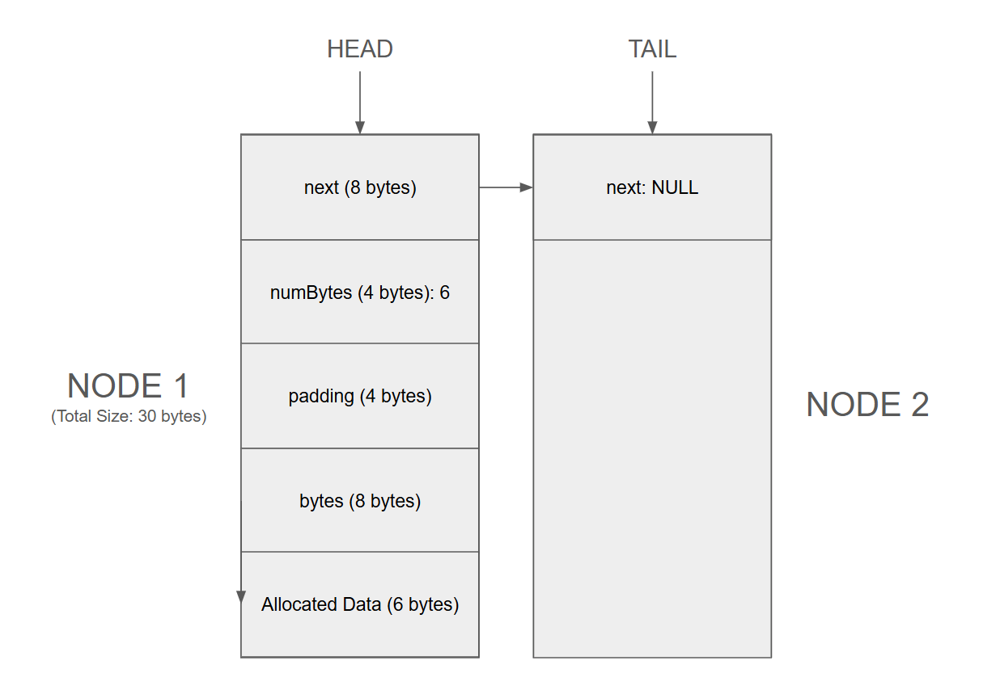

# Project 1

### 1. Which program is fastest? Is it always the fastest?

- Small/medium nodes + optimization: `alloca.out` is fastest (see `logs/5...`).
- Large nodes (512, 4096): `malloc.out` is slightly faster (see `logs/6...` and `logs/7...`).

Across all trials, `alloca.out` is often fastest but not always; it depends on node size and compiler flags.

### 2. Which program is slowest? Is it always the slowest?

Not always, but `list.out` is most often the slowest across all trials. `new.out` is close, but slightly faster.

#### Impact of Optimization Levels (1,000,000 Nodes)

| Program | Default (No Opt) | -O2 Optimization | -O3 -march=native |
| :--- | :--- | :--- | :--- |
| `alloca.out` | 0.400s | 0.142s | 0.158s |
| `list.out` | 1.296s | 0.208s | 0.198s |
| `malloc.out` | 0.326s | 0.158s | 0.150s |
| `new.out` | 1.184s | 0.198s | 0.196s |

Standard `-O2` provides a massive 3x-6x speedup across all methods. Interestingly, `-O3 -march=native` doesn't always perform better than `-O2` for `alloca`, showing stack allocation is already extremely efficient at these lower optimization levels.

### 3. Was there a trend in program execution time based on the size of data in each Node? If so, what, and why?

- Small size: allocation overhead matters more, so `alloca` wins.
- Large size: hashing/processing the data dominates, so all programs run similarly.

#### Payload Size Impact (1,000,000 Nodes)

| Payload Size | `alloca.out` | `list.out` | `malloc.out` | `new.out` |
| :--- | :--- | :--- | :--- | :--- |
| 10 Bytes | 0.074s | 0.140s | 0.090s | 0.138s |
| 100 Bytes (Avg) | 0.142s | 0.208s | 0.158s | 0.198s |
| 512 Bytes | 1.416s | 1.474s | 1.390s | 1.462s |
| 4096 Bytes | 1.424s | 1.490s | 1.406s | 1.458s |

For small sizes, `alloca` is nearly 2x faster than `list`/`new`. However, as sizes grow to 512+ bytes, the performance converges as the hashing workload begins to dominate the allocation time.

### 4. Was there a trend in program execution time based on the length of the block chain?

- Linear Scaling: Time increases directly with the number of blocks. 10x more blocks take about 10x more time.
- Consistency: The ranking stays the same. `alloca` is fastest, then `malloc`, then `new` and `list`.
- Small lists (like 1,000 blocks) are too fast to measure (0.00s). This could have been observed by timing in microseconds.

#### Average Execution Time (O2) by Block Chain Length

| Block Count | alloca.out | list.out | malloc.out | new.out |
| :--- | :--- | :--- | :--- | :--- |
| 1,000 | 0.000s | 0.000s | 0.000s | 0.000s |
| 10,000 | 0.000s | 0.006s | 0.000s | 0.006s |
| 100,000 | 0.020s | 0.030s | 0.020s | 0.028s |
| 1,000,000 | 0.150s | 0.228s | 0.160s | 0.210s |
| 10,000,000 | 1.604s | 2.458s | 1.796s | 2.278s |

### 5. Consider heap breaks, what's noticeable? Does increasing the stack size affect the heap? Speculate on any similarities and differences in programs?

- `alloca.out` shows very few heap breaks (~69).
- `malloc`, `new`, `list` show many more breaks and increase with size (see `breaks` logs).

Stack size does not increase the heap.

#### `brk` Calls

| Size | `alloca.out` | `list.out` | `malloc.out` | `new.out` |
| :--- | :--- | :--- | :--- | :--- |
| 10 Bytes | 69 | 661 | 460 | 661 |
| 64 Bytes | 69 | 1,246 | 1,068 | 1,246 |
| 100 Bytes | 69 | 933 | 751 | 933 |
| 512 Bytes | 69 | 6,217 | 6,040 | 6,217 |
| 4096 Bytes | 69 | 6,217 | 6,040 | 6,217 |

`alloca` is the only method with a constant number of heap breaks (69), as it lives on the stack. Other methods scale their heap requests as the size increases.

#### Memory Footprint for 1,000,000 Nodes

| Program | Default (No Opt) | -O2 Optimization |
| :--- | :--- | :--- |
| `alloca.out` | 202,750 KB | 93,310 KB |
| `list.out` | 117,520 KB | 117,520 KB |
| `malloc.out` | 93,320 KB | 93,330 KB |
| `new.out` | 117,510 KB | 117,530 KB |

Without optimization, `alloca` uses significantly more memory (~202MB), likely due to the compiler not reclaiming stack space as aggressively within the loop in debug mode. With `-O2`, its memory footprint drops to match `malloc`.

### 6. Considering either the malloc.cpp or alloca.cpp versions of the program, generate a diagram showing two Nodes. Include in the diagram
### the relationship of the head, tail, and Node next pointers.
### show the size (in bytes) and structure of a Node that allocated six bytes of data
### include the bytes pointer, and indicate using an arrow which byte in the allocated memory it points to.

### 7. There's an overhead to allocating memory, initializing it, and eventually processing (in our case, hashing it). For each program, were any of these tasks the same? Which one(s) were different?

- Allocation: different (`alloca` cheap, `malloc`/`new` cost more).
- Initialization & hashing: same work for same payload size and dominate for large payloads.
- Heap growth behavior: different (see breaks).

### 8. As the size of data in a Node increases, does the significance of allocating the node increase or decrease?

- Allocation matters less as size grows. For larger sizes, processing dominates.

### Reference (logs used):
- `logs/1...`, `logs/2...`, `logs/3...`, `logs/4...`, `logs/5...`, `logs/6...`, `logs/7...`, `logs/8...`