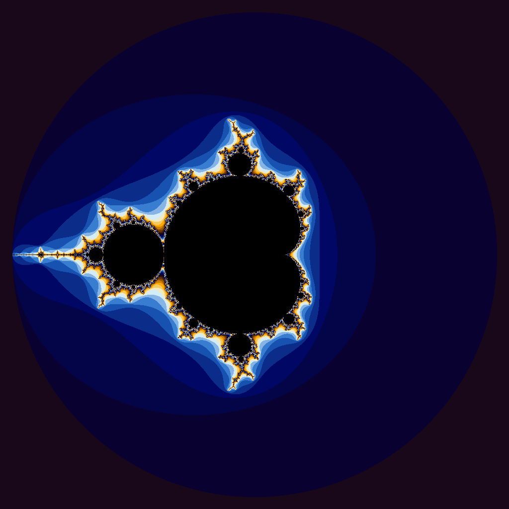
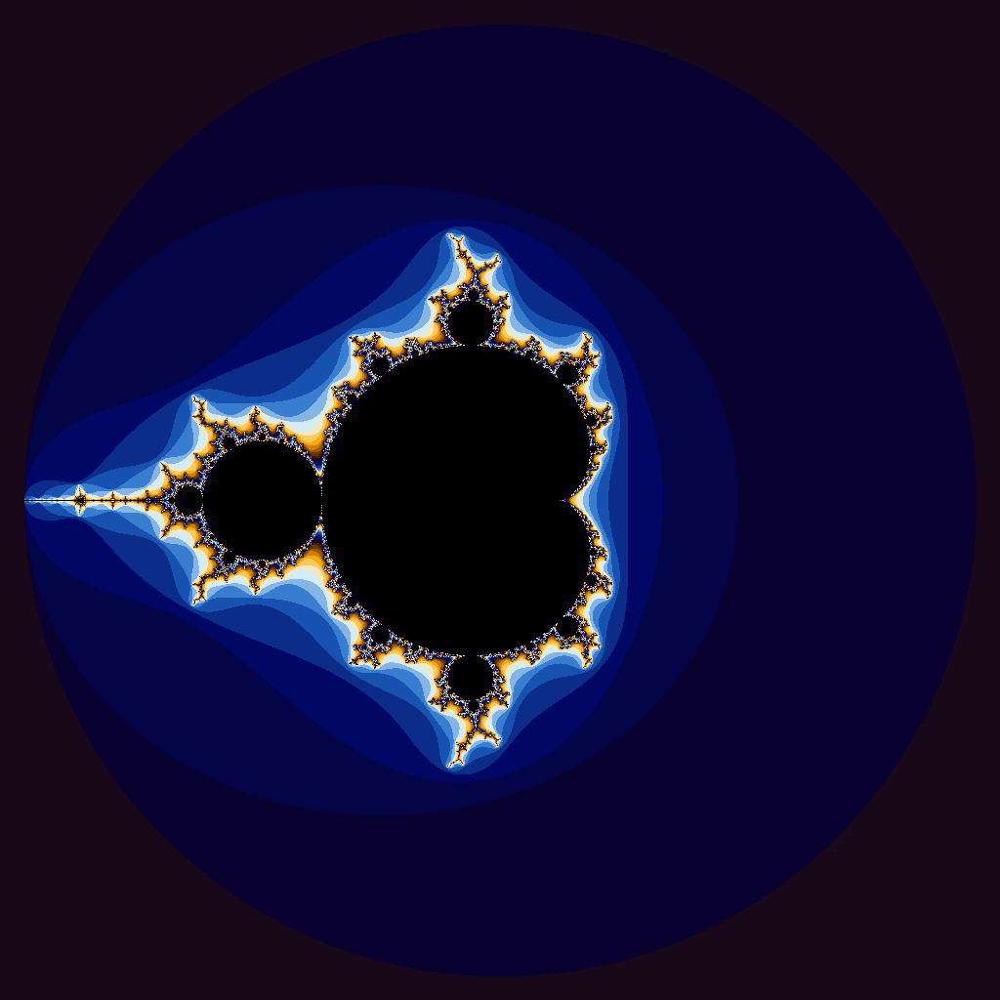
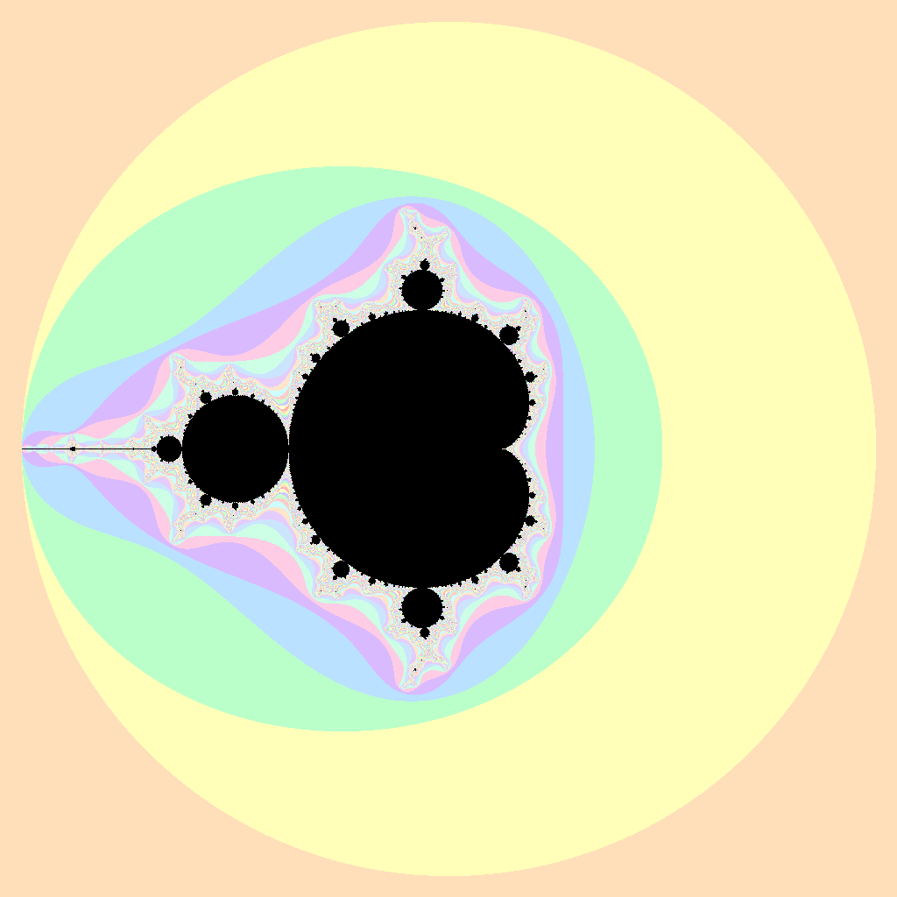

# Project 4: CUDA

## Program descriptions

### iota.cpp

`iota.cpp` is the normal CPU version. It fills a vector with increasing values using `std::iota`, then checks some of the values to make sure it worked. This was the basis of the GPU version.

### iota.cu

`iota.cu` does the same operation, but on the GPU. It copies the data over to the GPU, runs a CUDA kernel where each thread handles one spot in the array, and then copies the results back so they can be checked.

### julia.cpp

`julia.cpp` is the CPU version of the image generator. Since the starting value is `z = 0`, it makes a Mandelbrot set and saves it as a PPM image.

### julia.cu

`julia.cu` is the GPU version. Each CUDA thread works on one pixel of the image. I kept the original window into the complex plane, but I modified this version with a pastel color map.

## Iota timing results

### GPU output

|Vector Length|Wall Clock Time|User Time|System Time|
|:--:|--:|--:|--:|
|10| 0.33| 0.00| 0.30|
|100| 0.28| 0.01| 0.25|
|1000| 0.23| 0.01| 0.21|
|10000| 0.24| 0.01| 0.21|
|100000| 0.24| 0.01| 0.21|
|1000000| 0.27| 0.01| 0.24|
|5000000| 0.28| 0.01| 0.24|
|100000000| 0.88| 0.15| 0.71|
|500000000| 3.44| 0.72| 2.70|
|1000000000| 6.64| 1.58| 5.04|
|5000000000|41.82|11.32|30.51|

### CPU output

|Vector Length|Wall Clock Time|User Time|System Time|
|:--:|--:|--:|--:|
|10| 0.00| 0.00| 0.00|
|100| 0.00| 0.00| 0.00|
|1000| 0.00| 0.00| 0.00|
|10000| 0.00| 0.00| 0.00|
|100000| 0.00| 0.00| 0.00|
|1000000| 0.00| 0.00| 0.00|
|5000000| 0.02| 0.00| 0.02|
|100000000| 0.54| 0.09| 0.45|
|500000000| 2.81| 0.42| 2.38|
|1000000000| 5.84| 0.97| 4.86|
|5000000000|34.92| 6.09|28.80|

## Iota results reflection

The results make sense to me, but I was a little surprised that the CPU was faster than the GPU for every vector size that was tested. The `iota` operation is really simple, since each value is
just its index plus the starting value. That means the GPU is not doing very much actual math for each element.

Because of that, a lot of the CUDA version's time is probably spent on setup: allocating GPU memory, copying data to the GPU, launching the kernel, and then
copying the data back. For a problem this simple, that overhead can matter more than the parallelism helps. The CPU is already pretty fast at writing through a plain array, so CUDA does not seem like a great fit for this specific problem.

## Generated image

The first two images are the original Mandelbrot renders. One came from the CPU
program and one came from the GPU program. They look identical, which is what I
was hoping for, since the GPU version should be doing the same calculation.

### Original CPU output

*Original Mandelbrot set from `julia.cpp`, generated on the CPU.*

### Original GPU output

*Original Mandelbrot set from `julia.cu`, generated on the GPU. It matches the
CPU version above.*

### Pastel GPU output

*Pastel Mandelbrot set from `julia.cu`. This still uses the default starting
value `z = 0`, so it is a Mandelbrot set instead of a different Julia set.*
